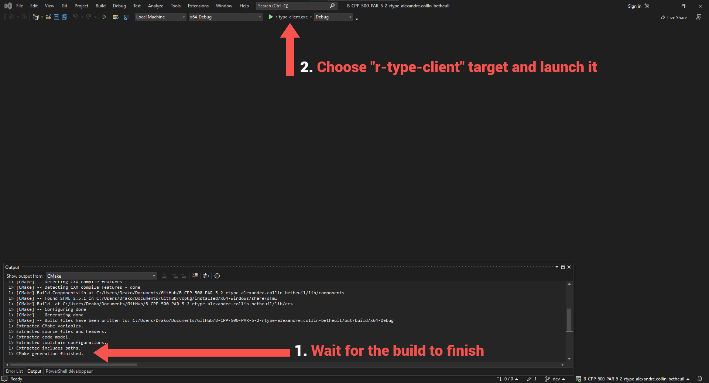

# R-Type

 


<h1 align="center">
  
  <br>
  
</h1>

<h3 align="center">Arcade video game</h3>

<p align="center">
    <a href="https://en.wikipedia.org/wiki/R-Type"></a>
</p>

# R-Type: Overview

[Français](README_fr.md)

R-Type is a classic side-scrolling shooter video game that was first released in arcades in 1987. The game is set in the distant future, where players control a spaceship tasked with saving humanity from an evil alien force. The gameplay involves navigating through a series of dangerous levels filled with enemies and obstacles, using the spaceship's weapons to defeat the aliens and destroy their ships. The game is known for its challenging difficulty, unique power-up system, and iconic boss battles. R-Type was well-received by audiences and critics upon its release, and it has since become a beloved classic in the shooting game genre.

# Table of Contents

- [R-Type: Overview](#r-type-overview)
- [Table of Contents](#table-of-contents)
- [Getting Started](#getting-started)
  - [Quick Start: Windows](#quick-start-windows)
  - [Quick Start: Unix](#quick-start-unix)
- [Examples](#examples)
- [License](#license)
- [Security](#security)

# Getting Started

## Quick Start: Windows

Prerequisites:

- Windows 7 or newer
- [Git](https://git-scm.com/downloads)
- [Visual Studio](https://visualstudio.microsoft.com/) 2015 Update 3 or greater with the English language pack
- [VCPKG] [VCPKG: Quickstart Windows](https://github.com/microsoft/vcpkg#quick-start-windows)

First, download the project; it can be installed anywhere.

```shell
git clone https://github.com/EpitechPromo2025/B-CPP-500-PAR-5-2-rtype-alexandre.collin-betheuil.git
```

You will need to install the sfml package with VCPKG.

```shell
vcpkg.exe install sfml:x64-windows
```

Note: You can setup VCPKG as an environment variable to use it anywhere, else you will need to use the full path like that.

```shell
path/to/vcpkg.exe install sfml:x64-windows
```

Setup the VCPKG_DIR [environment variable](https://docs.oracle.com/en/database/oracle/machine-learning/oml4r/1.5.1/oread/creating-and-modifying-environment-variables-on-windows.html) as path/to/vcpkg.

After this you can now open the cloned repository with Visual Studio, wait for it to build the project and launch the generated executable.



## Quick Start: Unix

Prerequisites:

- [Git](https://git-scm.com/downloads)
- g++ >= 6
- [VCPKG] [VCPKG: Quickstart Unix](https://github.com/microsoft/vcpkg#quick-start-unix)
- [autoconf libtool](https://www.gnu.org/software/autoconf/)

First, download the project; it can be installed anywhere.

```shell
git clone https://github.com/EpitechPromo2025/B-CPP-500-PAR-5-2-rtype-alexandre.collin-betheuil.git
```

You will need to install the sfml package with VCPKG.

```shell
vcpkg install sfml:x64-linux
```

Setup the VCPKG_DIR as an environment variable in the cloned repository.

```shell
export VCPKG_DIR=/path/to/vcpkg
```

Build the project with CMake.

```shell
cmake -B ./build/
```

Compile the project.

```shell
cd build/
make
```

Launch the binary.

```shell
./r-type_client
```

# Examples

See the [documentation](https://miniature-adventure-y2rz68e.pages.github.io) for specific usage of functions and explanation of classes.

# Contributing

R-Type is an open source project, and is thus built with your contributions. Here are some ways you can contribute:

[Submit Issues](https://github.com/EpitechPromo2025/B-CPP-500-PAR-5-2-rtype-alexandre.collin-betheuil/issues) in server/client/components

[Submit Fixes and new Implementations](https://github.com/EpitechPromo2025/B-CPP-500-PAR-5-2-rtype-alexandre.collin-betheuil/pulls)

Please refer to our [Contributing Guide](CONTRIBUTING.md) for more details.

# License

The code in this repository is licensed under the [GNU General Public License](LICENSE.md). The libraries provided by ports are licensed under the terms of their original authors.
